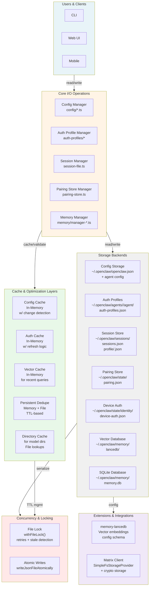
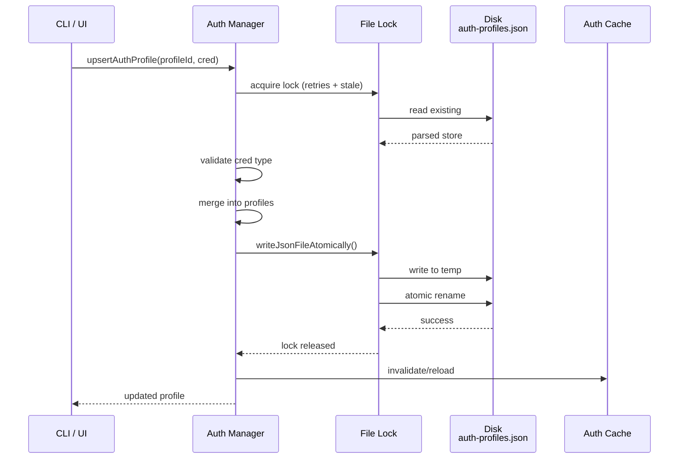
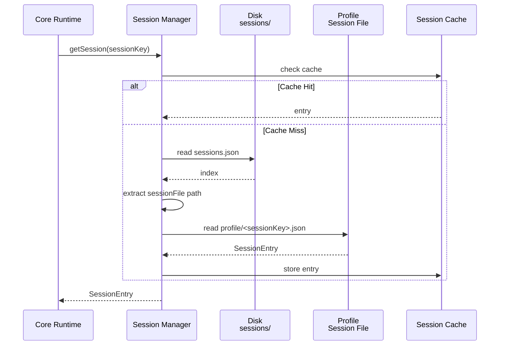
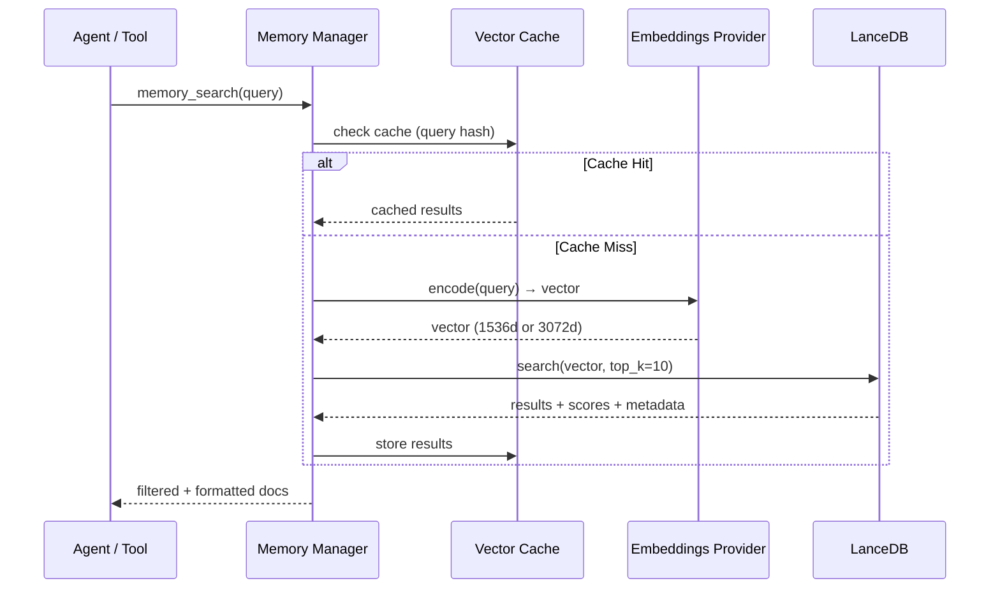

<!-- Persistence Layer: DB / File Storage / KV / Config -->

# Persistence Architecture: DB / File Storage / KV / Config

This document provides a detailed breakdown of OpenClaw's storage and persistence strategy for databases, key-value stores, file storage, and configuration management.

## Overview

OpenClaw's persistence layer is **distributed and modular**, with different storage backends optimized for different use cases:

- **Vector Database**: LanceDB (embeddings + vector search)
- **Session/Transactional Data**: SQLite (via `node:sqlite`)
- **JSON Key-Value Stores**: File-backed with file-lock semantics (auth, pairing, config)
- **File Storage**: Direct filesystem (`~/.openclaw/*`)
- **In-Memory Caches**: TTL + LRU with optional disk spillover
- **Configuration**: JSON files + schema validation (Zod)

## Component Architecture



## Storage Layer Details

### 1. Configuration Storage

**Location**: `~/.openclaw/openclaw.json` (+ per-agent config)

**Managed By**: `src/config/config.ts` and friends

**Key Features**:
- Zod schema validation (`config/zod-schema.ts`)
- Change detection (config watchers)
- Per-agent overrides at `~/.openclaw/agents/<agentId>/agent/config.json`
- Path-based getter/setter: `getConfigValueAtPath()`, `setConfigValueAtPath()`

**Schema Structure**:
```typescript
OpenClawSchema = {
  $schema?: string,
  auth?: { profiles?: {}, order?: [] },
  gateway?: { port, host, mode },
  session?: { store: "path/to/sessions.json" },
  memory?: { store: { path, vector: { enabled } } },
  commands?: { text?: boolean },
  // ... more settings
}
```

**Cache**: In-memory with change tracking (`.configChanged()`)

---

### 2. Auth Profiles Storage

**Location**: `~/.openclaw/agents/<agentId>/agent/auth-profiles.json`

**Managed By**: `src/agents/auth-profiles/*`

**Data Structure**:
```typescript
AuthProfileStore {
  version: 1,
  profiles: {
    "provider:profileId": {
      type: "api_key" | "oauth",
      provider: string,
      // api_key: { key: string }
      // oauth: { access, refresh?, expires, email?, projectId?, enterpriseUrl? }
    }
  }
}
```

**Concurrency**:
- File-locked reads/writes via `withFileLock()` with retry + stale detection
- Lock options: 10 retries, exponential backoff 100ms-10s, stale after 30s

**Related Files**:
- Runtime cache (transient): `~/.openclaw/agents/<agentId>/agent/auth.json`
- Legacy import file (read-only): `~/.openclaw/credentials/oauth.json`

**Operations**:
- Load profiles: `loadAuthProfileStore()` (with migration/validation)
- Upsert: `upsertAuthProfile()` (validates type, updates profusely)
- Save: `saveAuthProfileStore()` (atomic write)

---

### 3. Session Storage

**Location**: `~/.openclaw/sessions/`

**Managed By**: `src/config/sessions/session-file.ts`

**Structure**:
```
~/.openclaw/sessions/
├── sessions.json       # Index: { sessionKey -> SessionEntry }
├── profile/            # Per-profile session data
│   └── <sessionKey>.json
```

**SessionEntry**:
```typescript
{
  sessionId: string,      // UUID
  sessionKey: string,     // routing key
  sessionFile: string,    // path to profile/<sessionKey>.json
  updatedAt: number,      // timestamp
}
```

**Operations**:
- Create/resolve session: `resolveAndPersistSessionFile()`
- Update store: `updateSessionStore()` (transactional)
- Load/save: atomic JSON file operations

---

### 4. Pairing Store

**Location**: `~/.openclaw/state/pairing.json` (or config-overridden path)

**Managed By**: `src/pairing/pairing-store.ts`

**Data Structure**:
```typescript
PairingStore {
  version: 1,
  requests: PairingRequest[]
}

PairingRequest {
  code: string,          // 8-char code (A-Z, 2-9)
  userId: string,
  deviceId: string,
  createdAt: number,
  accountId?: string,
}
```

**Features**:
- TTL pruning: 60 minutes (configurable)
- Max pending requests: 3
- File-locked + atomic writes
- Backward-compatible version schema

---

### 5. Device Auth Store

**Location**: `~/.openclaw/state/identity/device-auth.json`

**Managed By**: `src/infra/device-auth-store.ts`

**Data Structure**:
```typescript
DeviceAuthStore {
  version: 1,
  deviceId: string,
  tokens: {
    [tokenName: string]: string
  }
}
```

**File Permissions**: `0o600` (owner read/write only)

**Operations**:
- Read: parse + validate version/schema
- Write: atomic with explicit chmod

---

### 6. Vector Database (LanceDB)

**Location**: `~/.openclaw/memory/lancedb/` (configurable)

**Managed By**: `extensions/memory-lancedb/`

**Features**:
- **Library**: LanceDB (fast vector search on disk)
- **Index Type**: HNSW (Hierarchical Navigable Small World) + Faiss
- **Embeddings Provider**: OpenAI (configurable model)
- **Vector Dims**: 1536 (3-small) or 3072 (3-large)

**Config Schema**:
```typescript
MemoryConfig {
  embedding: {
    provider: "openai",
    model?: "text-embedding-3-small", // default
    apiKey: string,                    // or ${OPENAI_API_KEY}
  },
  dbPath?: string,                     // ~/ expansion supported
  autoCapture?: boolean,               // capture agent outputs
  autoRecall?: boolean,                // inject retrieved context (default: true)
  captureMaxChars?: number,            // 100-10000, default 500
}
```

**Operations**:
- Initialize: `db.connect(dbPath)` + create/open table
- Write: `insert_into()` with metadata (source, timestamp, tags)
- Query: `vector_search()` → top-N results + scores
- Cleanup: TTL + archival per policy

---

### 7. SQLite Database

**Location**: `~/.openclaw/memory/memory.db` (configurable)

**Managed By**: `src/memory/manager-sync-ops.ts`

**Library**: Node's `sqlite` (sync) with optional vector extension

**Use Cases**:
- Historical message storage
- Structured memory queries
- Transactional consistency (multiple tables)

**Tables**:
- `memories` (id, content, embeddings, source, timestamp, metadata)
- `tags` (memory_id, tag)
- etc.

**Operations**:
- Open: `new DatabaseSync(dbPath, { allowExtension })`
- Query: SQL with parameterized placeholders to prevent injection
- Persist: synchronous writes + VACUUM

---

## Cache Layers

### 1. Config Cache

**In Memory**: Parsed config object + `$schema` validation

**Invalidation**: On file change detection (watcher or explicit)

**Access**: `resolveConfig()`, `getConfigValueAtPath()`

---

### 2. Auth Profile Cache

**In Memory**: Loaded ProfileStore + usage stats

**Refresh**: Explicit call to `reloadAuthProfileStore()`

**Eviction**: On external file modification

---

### 3. Vector Search Cache

**In Memory**: Recent query embeddings + results

**TTL**: Configurable, typically 1-5 minutes

**Bypass**: Direct DB query on miss or cache invalidation

---

### 4. Persistent Dedupe

**Hybrid (Memory + File)**:
```typescript
PersistentDedupe {
  checkAndRecord(key, namespace): Promise<boolean>
}
```

**Components**:
- **Memory Layer**: LRU cache with TTL expiration
- **File Layer**: JSON entries per namespace (max configurable)
- **Lock**: File-lock on write for concurrent safety

**Config**:
```typescript
{
  ttlMs: 24 * 60 * 60 * 1000,        // 24 hours
  memoryMaxSize: 100,                // in-memory entries
  fileMaxEntries: 1000,              // persisted per namespace
  resolveFilePath: (ns) => path.join(root, `${ns}.json`)
}
```

---

### 5. Directory Cache

**In Memory**: Cached model/resource directory listings

**Type**: `DirectoryCache<T>` (generic key-value with TTL)

**Eviction**: LRU on overflow (max size configurable, ~2000 default)

**Reset**: On config change

---

## Concurrency & Locking

### File Locking Strategy

**Implementation**: `src/infra/file-lock.ts` → `withFileLock()`

**Algorithm**:
1. Try acquire lock (fast path)
2. On contention, retry with exponential backoff
3. Detect stale locks (30s default, configurable)
4. Atomic write within lock scope

**Config**:
```typescript
FileLockOptions {
  retries: {
    retries: 10,
    factor: 2,                      // 100ms → 200ms → 400ms ...
    minTimeout: 100,
    maxTimeout: 10_000,
    randomize: true,               // jitter
  },
  stale: 30_000,                    // 30s before lock is considered stale
}
```

**Used By**:
- Auth profiles (store.ts)
- Pairing store (pairing-store.ts)
- Persistent dedupe (pseudo lock for namespace files)

---

### Atomic Writes

**Function**: `writeJsonFileAtomically(path, data)`

**Steps**:
1. Write to temp file (`.tmp.json`)
2. Rename atomically (POSIX rename)
3. Implicit: ensures no partial writes on crash

**Used By**:
- All JSON store operations (auth, sessions, pairing, config)

---

## Data Flow Diagrams

### Write Flow: Auth Profile Update



### Read Flow: Session Retrieval



### Vector Search Flow



---

## State Directory Override

All paths respect `$OPENCLAW_STATE_DIR` environment variable:

```bash
export OPENCLAW_STATE_DIR=/custom/path
# Auth: /custom/path/agents/<agentId>/agent/auth-profiles.json
# Config: /custom/path/openclaw.json
# Sessions: /custom/path/sessions/
```

Resolution: `resolveStateDir(env)` then path joins for consistency.

---

## Integration Points

### memory-lancedb Extension

```typescript
// Registers memory-core tools after LanceDB init
const memoryPlugin = {
  id: "memory-lancedb",
  kind: "memory",
  configSchema: memoryConfigSchema,
  
  register(runtime) {
    // Initialize LanceDB at dbPath
    const db = await connect(dbPath);
    
    // Register tools
    runtime.tools.registerTool(createMemorySearchTool(db));
    runtime.tools.registerTool(createMemoryGetTool(db));
    runtime.tools.registerTool(createMemoryUpdateTool(db));
    
    return { db, initialized: true };
  }
};
```

### Matrix Client Storage

```typescript
// SimpleFsStorageProvider for Matrix SDK storage
const storagePaths = resolveMatrixStoragePaths({
  homeserver, userId, accessToken, accountId
});
const storage = new SimpleFsStorageProvider(storagePaths.storagePath);

// Crypto storage (if encryption enabled)
const cryptoStorage = new StoreType(storagePaths.cryptoPath);
```

---

## Best Practices & Patterns

1. **Always use file locks** for JSON stores with concurrent access
2. **Validate on read**: Zod schemas for config, type guards for auth
3. **Atomic writes**: Use `writeJsonFileAtomically()` to prevent corruption
4. **Cache invalidation**: Clear caches on external file modifications
5. **TTL-based eviction**: Dedupe, memory caches with configurable TTL
6. **Fallback handling**: Read-only JSON with sensible defaults on parse failure
7. **Permissions**: Set `0o600` on sensitive files (auth, device tokens)
8. **Error resilience**: Graceful degradation on lock contention, missing files

---

## Configuration Reference

Key config keys under `~/.openclaw/openclaw.json`:

```json
{
  "auth": {
    "profiles": {
      "provider:id": { "provider": "...", "mode": "api_key|oauth" }
    },
    "order": ["provider:default", "provider:secondary"]
  },
  "gateway": {
    "port": 18789,
    "host": "localhost",
    "mode": "local"
  },
  "session": {
    "store": "~/.openclaw/sessions/sessions.json"
  },
  "memory": {
    "store": {
      "type": "sqlite|lancedb",
      "path": "~/.openclaw/memory/memory.db",
      "vector": {
        "enabled": true
      }
    }
  },
  "commands": {
    "text": true
  }
}
```

---

## File Permissions & Security

| Path | Permissions | Owner | Purpose |
|------|-------------|-------|---------|
| `~/.openclaw/agents/<agentId>/agent/auth-profiles.json` | `0o600` | User | API keys + OAuth tokens |
| `~/.openclaw/state/identity/device-auth.json` | `0o600` | User | Device identity |
| `~/.openclaw/memory/lancedb/` | `0o700` | User | Vector DB index |
| `~/.openclaw/openclaw.json` | `0o644` | User | Config (public) |
| `~/.openclaw/credentials/oauth.json` | `0o600` | User | Legacy (import-only) |

---

## Performance Characteristics

| Storage Type | Latency | Throughput | Typical Size | Scaling |
|--------------|---------|-----------|--------------|---------|
| Config (in-memory) | <1ms | N/A | <1 MB | Linear |
| Auth Profiles (file) | 1-10ms | 100+ ops/s | <100 KB | O(n profiles) |
| Sessions (file) | 1-10ms | 100+ ops/s | <1 MB | O(n sessions) |
| Vector DB (LanceDB) | 10-100ms | 1k+ queries/s | 10-1000 MB | O(log n) HNSW |
| SQLite (memory.db) | 1-50ms | 100+ txns/s | 100-10000 MB | O(n) full scan |

---

**File created to store detailed persistence architecture documentation.**
